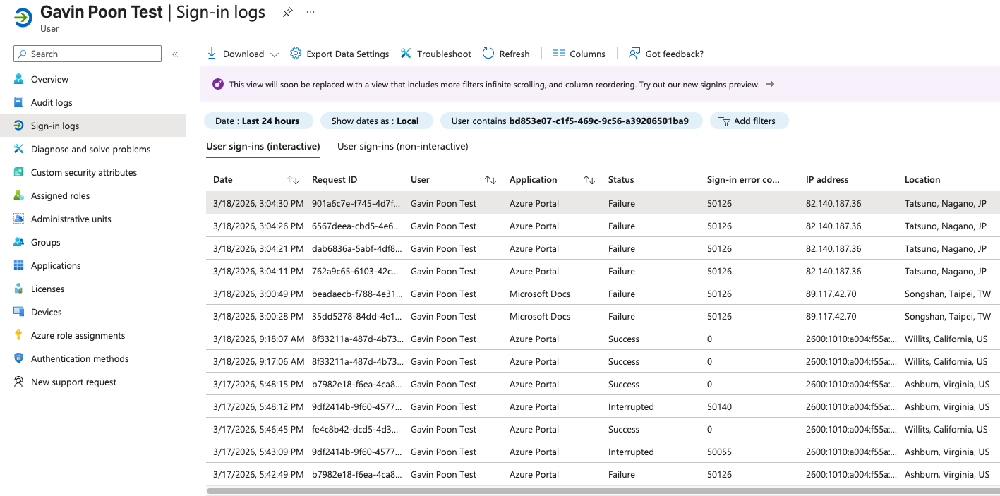
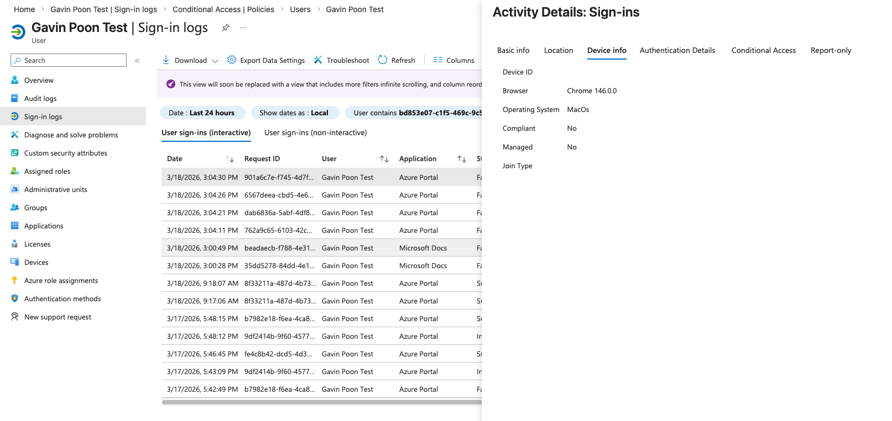

# Suspicious Sign-In Investigation

> Status: Draft

## Scenario

Multiple failed authentication attempts were generated against an authorized test account from unfamiliar locations. The objective was to determine which details distinguished the simulated activity from the account’s normal sign-in behavior.

## Investigation Process

1. Established a baseline using the test account’s previous successful sign-ins.
2. Generated multiple failed sign-in attempts using an alternate browser and VPN locations.
3. Reviewed the resulting events in Microsoft Entra sign-in logs.
4. Compared timestamps, authentication results, IP information, geolocation, browser, and previous account activity.
5. Evaluated whether the combined evidence indicated normal user error or suspicious behavior.

## Findings

* Six failed authentication attempts occurred within approximately five minutes.
* Several attempts were separated by only seconds.
* The events originated from IP addresses and geographic locations not present in the account’s normal activity.
* The browser differed from the one normally associated with successful sign-ins.
* Previous successful activity provided a useful behavioral baseline for comparison.
* No single attribute was treated as conclusive evidence of malicious activity.

## Assessment

The frequency of failures, unfamiliar network information, geographic inconsistency, and browser difference collectively made the activity suspicious. The pattern was more consistent with a simulated brute-force attempt than an ordinary password mistake.

Geolocation alone is not reliable proof of compromise. VPN use, mobile networks, ISP routing, and IP geolocation inaccuracies can produce misleading locations. A real investigation should correlate sign-in activity with device identity, authentication details, user history, threat intelligence, and confirmation from the affected user.

## Recommended Response

If this activity occurred in a production environment, appropriate next steps would include:

* Confirming the activity with the account owner.
* Reviewing successful sign-ins near the same time window.
* Checking MFA and Conditional Access results.
* Investigating whether unfamiliar devices or sessions were present.
* Revoking active sessions and resetting credentials if compromise were confirmed.
* Blocking confirmed malicious indicators when supported by sufficient evidence.
* Continuing to monitor the account for additional suspicious activity.

## Security Concepts Demonstrated

* Identity threat investigation
* Sign-in log analysis
* Behavioral baselining
* Brute-force detection
* Evidence correlation
* Incident triage
* Account-containment decision-making

## Evidence

### Failed Sign-In Pattern

The sign-in log shows six failed authentication attempts within approximately five minutes. Four attempts originated from a Japanese VPN endpoint, while two originated from a Taiwanese VPN endpoint. All six returned error code `50126`, indicating invalid credentials.

The surrounding successful events provide a baseline showing the account’s normal United States activity. This contrast contributed to the suspicious assessment but was evaluated alongside timing, application, browser, and network information.

### Device Context

The selected event recorded Chrome on macOS. Entra ID also reported that the device was unmanaged and noncompliant. This information provides additional investigative context, although device-management status alone does not establish that an authentication attempt was malicious.
